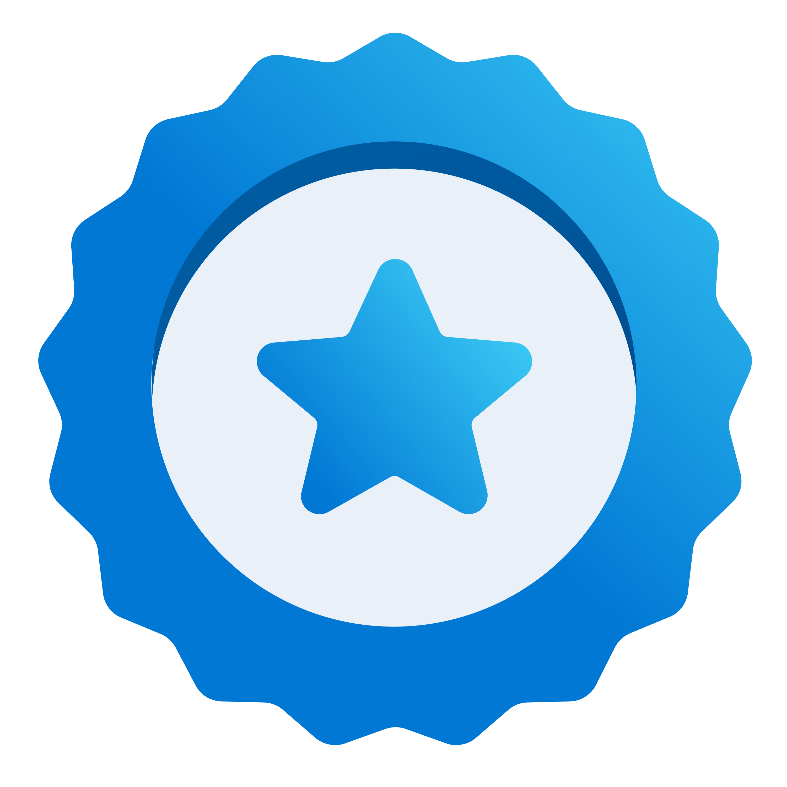
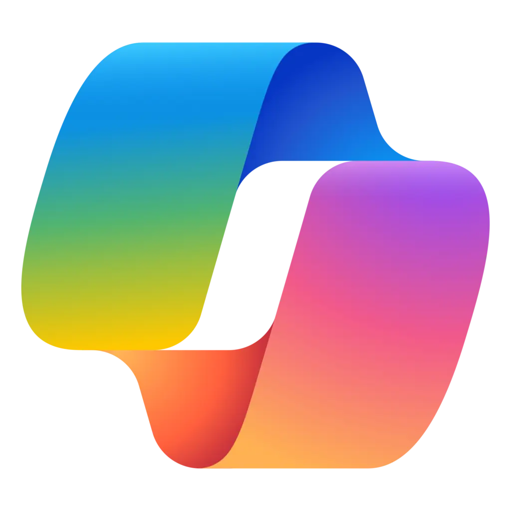

# New Microsoft One Day Trainings

|   |   |
| - | - |
|  | Applied Skill (APL) [Browse the full list of Microsoft Applied Skills.](https://learn.microsoft.com/en-us/credentials/browse/?credential_types=applied%20skills)  |
| ✅ | Assessment available |
| ❌ | This assessment is currently undergoing maintenance |
|  | M365 Copilot related |

 
 
updated on July 4, 2024

[copilot]: media/copilot.png

|                                      |                                        |         | Learning Path                                                                                                         | Labs                                     |
| -------------------------------------| -------------------------------------- | ------- | --------------------------------------------------------------------------------------------------------------------- |------------------------------------------|
| ✅[APL][050 APL]|                                        | AI-050  | [Develop generative AI solutions with Azure OpenAI Service][050 LP]                                                   | [Repo][050 Repo]    [HTML][050 HTML]  |
| ✅[APL][3002 APL]|                                        | AI-3002 | [Create an intelligent document processing solution with Azure AI Document Intelligence][3002 LP]                     | [Repo][3002 Repo]   [HTML][3002 HTML] |
| ✅[APL][3003 APL]|                                        | AI-3003 | [Build a natural language processing solution with Azure AI Language][3003 LP]                                        | [Repo][3003 Repo]   [HTML][3003 HTML] |
| ❌[APL][3004 APL]|                                        | AI-3004 | [Build an Azure AI Vision solution][3004 LP]                                                                          | [Repo][3004 Repo]   [HTML][3004 HTML] |
| ❌|| AI-3016 | [Develop copilots with Azure AI Studio][3016 LP]                                                                      |                                          |
|                                      |                                        | AI-3017 | [Microsoft AI for business leaders][3017 LP]                                                                          |                                          |
|                                      || AI-3018 | [Copilot Foundations][3018 LP]                                                                                        |                                          |
| ❌[APL][1001 APL]|                                        | AZ-1001 | **Retired!** [Deploy containers by using Azure Kubernetes Service][1001 LP]                                           | [Repo][1001 Repo]   [HTML][1001 HTML] |
| ✅[APL][1002 APL]|                                        | AZ-1002 | [Configure secure access to your workloads using Azure networking][1002 LP]                                           | [Repo][1002 Repo]   [HTML][1002 HTML] |
| ✅[APL][1003 APL]|                                        | AZ-1003 | [Secure storage for Azure Files and Azure Blob Storage][1003 LP]                                                      | [Repo][1003 Repo]   [HTML][1003 HTML] |
| ❌[APL][1004 APL]|                                        | AZ-1004 | [Deploy and configure Azure Monitor][1004 LP]                                                                         | [Repo][1004 Repo]   [HTML][1004 HTML] |
|                                      |                                        | AZ-1005 | [Configuring Azure Virtual Desktop for the Enterprise][1005 LP]                                                       |                                          |
|                                      |                                        | AZ-1006 | [Migrate and modernize SAP in the Microsoft Cloud][1006 LP]                                                           |                                          |
| ✅[APL][1008 APL]|                                         | AZ-1008 | Administer Active Directory Domain Services                                                                           |                                          |
| ✅[APL][yyyy APL]|                                         | AZ-yyyy | Deploy and manage Microsoft Azure Arc-enabled servers                                                                 | [Repo][yyyy Repo]                                          |
| ✅[APL][2001 APL]|                                         | AZ-2001 | [Implement security through a pipeline using Azure DevOps][2001 LP]                                                   | [Repo][2001 Repo]   [HTML][2001 HTML] |
| ✅[APL][2002 APL]|                                         | AZ-2002 | [Develop an ASP.NET Core web app that consumes an API][2002 LP]                                                       | [Repo][2002 Repo]   [HTML][2002 HTML] |
| ✅[APL][2003 APL]|                                         | AZ-2003 | [Deploy cloud-native applications using Azure Container Apps][2003 LP]                                                | [Repo][2003 Repo]   [HTML][2003 HTML] |
| ✅[APL][2005 APL]|                                         | AZ-2005 | [Develop AI agents using Azure OpenAI and the Semantic Kernel SDK][2005 LP]                                           | [Repo][2005 Repo]   [HTML][2005 HTML] |
|                                     |                                        | AZ-2007 | [Accelerate app development by using GitHub Copilot][2007 LP]                                                         |                                          |
|                                     |                                        | AZ-2008 | [DevOps Foundations: The Core Principles and Practices][2008 LP]                                                      | [Repo][2008 Repo]   [HTML][2008 HTML] |
| ✅[APL][3001 APL]|                                        | DP-3001 | [Migrate SQL Server workloads to Azure SQL Database][3001 LP]                                                         | [Repo][3001 Repo]   [HTML][3001 HTML] |
| ❌[APL][3007 APL]|                                        | DP-3007 | [Train and deploy a machine learning model with Azure Machine Learning][3007 LP]                                      | [Repo][3007 Repo]   [HTML][3007 HTML] |
|                                     |                                        | DP-3011 | [Implementing a Data Analytics Solution with Azure Databricks][3011 LP]                                               |                                          |
|                                     |                                        | DP-3012 | [Implementing a Data Analytics Solution with Synapse Analytics][3012 LP]                                              |                                          |
|                                     |                                        | DP-3014 | [Implementing a Machine Learning Solution with Azure Databricks][3014 LP]                                             |                                          |
|                                     |                                        | DP-3015 | [Getting Started with Cosmos DB NoSQL Development][3015 LP]                                                           |                                          |
| ❌[APL][601 APL]|                                        | DP-601  | [Implement a lakehouse in Microsoft Fabric][601 LP]                                                                   |                                          |
| ❌[APL][602 APL]|                                        | DP-602  | [Implement a data warehouse in Microsoft Fabric][602 LP]                                                              |                                          |
| ❌[APL][603 APL]|                                        | DP-603  | [Implementing Real-Time Intelligence with Microsoft Fabric][603 LP]                                                   |                                          |
| ❌[APL][604 APL]|                                        | DP-604  | [Implement a data science and machine learning solution with Microsoft Fabric][604 LP]                                |                                          |
|                                     |                                        | MD-4011 | Enhance Endpoint Security with Microsoft Intune and Microsoft Copilot for Security                                    |                                          |
| ❌[APL][4001 APL]|                                        | MS-4001 | [Build collaborative apps for Microsoft Teams][4001 LP]                                                               | [Repo][4001 Repo]   [HTML][4001 HTML] |
|                                     || MS-4004 | [Empower your workforce with Copilot for Microsoft 365 Use Cases][4004 LP]                                            | [Repo][4004 Repo]   [HTML][4004 HTML] |
|                                     || MS-4005 | [Craft effective prompts for Microsoft Copilot for Microsoft 365][4005 LP]                                            | [Repo][4005 Repo]   [HTML][4005 HTML] |
|                                     || MS-4006 | [Copilot for Microsoft 365 for Administrators][4006 LP]                                                               | [Repo][4006 Repo]   [HTML][4006 HTML] |
|                                     || MS-4007 | [Copilot for Microsoft 365 User Enablement Specialist][4007 LP]                                                       |                                          |
|                                     || MS-4008 | [Copilot for Microsoft 365 Interactive Experience for Executives][4008 LP]                                            |                                          |
|                                     || MS-4010 | [Build Plugins and Connectors for Microsoft Copilot for Microsoft 365][4010 LP]                                       | [Repo][4010 Repo]                        |
|                                     || MS-4011 |                                       | [Repo][4010 Repo]                        |
|                                     || MS-4012 | Microsoft Copilot Web Based Interactive experience for Executives                                                     |                                          |
|                                     || MS-4014 | Microsoft Copilot Web Based Interactive experience for Executives                                                     |                                          |
| ❌[APL][7001 APL]|                                        | PL-7001 | [Create and manage canvas apps with Power Apps][7001 LP]                                                              | [Repo][7001 Repo]   [HTML][7001 HTML] |
| ❌[APL][7002 APL]|                                        | PL-7002 | [Create and manage automated processes by using Power Automate][7002 LP]                                              | [Repo][7002 Repo]   [HTML][7002 HTML] |
| ❌[APL][7003 APL]|                                        | PL-7003 | [Create and manage model-driven apps with PowerApps and Dataverse][7003 LP]                                           | [Repo][7003 Repo]   [HTML][7003 HTML] |
| || PL-7008 | Create custom copilots with Copilot Studio                                                                            |                                          |
| ✅[APL][5001 APL]|                                        | SC-5001 | [Configure SIEM security operations using Microsoft Sentinel][5001 LP]                                                | [Repo][5001 Repo]   [HTML][5001 HTML] |
| ✅[APL][5002 APL]|                                        | SC-5002 | [Secure Azure services and workloads with Microsoft Defender for Cloud regulatory compliance controls][5002 LP]       | [Repo][5002 Repo]   [HTML][5002 HTML] |
| |                                        | SC-5003 | [Implement information protection and data loss prevention by using Microsoft Purview][5003 LP]                       | [Repo][5003 Repo]   [HTML][5003 HTML] |
|                                     |                                        | SC-5006 | [Get started with Microsoft Copilot for Security][5006 LP]                                                            |                                          |
| |                                        | SC-5007 | Implement retention, eDiscovery, and Communication compliance in Microsoft Purview                                    |                                          |
|                                     |                                        | SC-5008 | [Configure and manage entitlement with Microsoft Entra ID][5008 LP]                                                   |                                          |

[1008 LP]:   https://learn.microsoft.com/en-us/training/paths/administer-active-directory-domain-services/
[1008 APL]:  https://learn.microsoft.com/en-us/credentials/applied-skills/administer-active-directory-domain-services/

[yyyy LP]:    https://learn.microsoft.com/en-us/training/paths/deploy-manage-azure-arc-enabled-servers/
[yyyy APL]:   https://learn.microsoft.com/en-us/credentials/applied-skills/deploy-and-manage-microsoft-azure-arc-enabled-servers/
[yyyy Repo]:  https://github.com/MicrosoftLearning/Deploy-and-manage-Azure-Arc-enabled-Servers

[050 LP]:   https://learn.microsoft.com/en-us/training/paths/develop-ai-solutions-azure-openai/
[050 APL]:  https://learn.microsoft.com/en-us/credentials/applied-skills/develop-generative-ai-solutions-with-azure-openai-service/
[050 Repo]: https://github.com/MicrosoftLearning/mslearn-openai/tree/main
[050 HTML]: https://microsoftlearning.github.io/mslearn-openai/

[1001 LP]:   https://learn.microsoft.com/en-us/training/paths/deploy-manage-containers-azure-kubernetes-service/
[1001 APL]:  https://learn.microsoft.com/en-us/credentials/applied-skills/deploy-containers-by-using-azure-kubernetes-service/
[1001 Repo]: https://github.com/MicrosoftLearning/deploy-and-manage-containers-with-azure-kubernetes-service
[1001 HTML]: https://github.com/MicrosoftLearning/deploy-and-manage-containers-with-azure-kubernetes-service/blob/master/Instructions/Labs/Complete%20Guided%20Exercise-Deploy%20Applications%20to%20AKS.md

[1002 LP]:   https://learn.microsoft.com/en-us/training/paths/configure-secure-workloads-using-azure-virtual-networking/
[1002 APL]:  https://learn.microsoft.com/en-us/credentials/applied-skills/configure-secure-workloads-use-azure-virtual-networking/
[1002 Repo]: https://github.com/MicrosoftLearning/Configure-secure-access-to-workloads-with-Azure-virtual-networking-services
[1002 HTML]: https://microsoftlearning.github.io/Configure-secure-access-to-workloads-with-Azure-virtual-networking-services/

[1003 LP]:   https://learn.microsoft.com/en-us/training/paths/implement-storage-azure-files-azure-blob-storage/
[1003 APL]:  https://learn.microsoft.com/en-us/credentials/applied-skills/secure-storage-azure-files-azure-blob-storage/
[1003 Repo]: https://github.com/MicrosoftLearning/Secure-storage-for-Azure-Files-and-Azure-Blob-Storage
[1003 HTML]: https://microsoftlearning.github.io/Secure-storage-for-Azure-Files-and-Azure-Blob-Storage/

[1004 LP]:   https://learn.microsoft.com/en-us/training/paths/deploy-configure-azure-monitor/
[1004 APL]:  https://learn.microsoft.com/en-us/credentials/applied-skills/deploy-and-configure-azure-monitor/
[1004 Repo]: https://github.com/MicrosoftLearning/APL-1004-deploy-configure-azure-monitor
[1004 HTML]: https://microsoftlearning.github.io/APL-1004-deploy-configure-azure-monitor/

[1005 LP]:   https://learn.microsoft.com/en-us/training/courses/az-1005

[1006 LP]:   https://learn.microsoft.com/en-us/training/courses/az-1006

[2001 LP]:   https://learn.microsoft.com/en-us/training/paths/implement-security-through-pipeline-using-devops/
[2001 APL]:  https://learn.microsoft.com/en-us/credentials/applied-skills/implement-security-through-pipeline-using-devops/
[2001 Repo]: https://github.com/MicrosoftLearning/implement-security-through-pipeline-using-devops
[2001 HTML]: https://microsoftlearning.github.io/implement-security-through-pipeline-using-devops/

[2002 LP]:   https://learn.microsoft.com/en-us/training/paths/develop-asp-core-api/
[2002 APL]:  https://learn.microsoft.com/en-us/credentials/applied-skills/develop-an-aspnet-core-web-app-that-consumes-an-api/
[2002 Repo]: https://github.com/MicrosoftLearning/APL-2002-develop-aspnet-core-consumes-api
[2002 HTML]: https://microsoftlearning.github.io/APL-2002-develop-aspnet-core-consumes-api/

[2003 LP]:   https://learn.microsoft.com/en-us/training/paths/deploy-cloud-native-applications-to-azure-container-apps/
[2003 APL]:  https://learn.microsoft.com/en-us/credentials/applied-skills/deploy-cloud-native-apps-using-azure-container-apps/
[2003 Repo]: https://github.com/MicrosoftLearning/az-2003-deploy-cloud-native-applications-using-azure-container-apps
[2003 HTML]: https://microsoftlearning.github.io/az-2003-deploy-cloud-native-applications-using-azure-container-apps/

[2005 LP]:   https://learn.microsoft.com/en-us/training/paths/develop-ai-agents-azure-open-ai-semantic-kernel-sdk/
[2005 APL]:  https://learn.microsoft.com/en-us/credentials/applied-skills/develop-ai-agents-using-microsoft-azure-openai-and-semantic-kernel/
[2005 Repo]: https://github.com/MicrosoftLearning/AZ-2005-Develop-AI-agents-OpenAI-Semantic-Kernel-SDK
[2005 HTML]: https://github.com/MicrosoftLearning/AZ-2005-Develop-AI-agents-OpenAI-Semantic-Kernel-SDK/tree/master/Instructions/Labs

[2007 LP]:   https://learn.microsoft.com/en-us/training/paths/accelerate-app-development-using-github-copilot/

[2008 LP]:   https://learn.microsoft.com/en-us/training/paths/devops-foundations-core-principles-practices/
[2008 Repo]: https://github.com/MicrosoftLearning/AZ-2008_DevOps_Foundations_Core_Principles_Practices
[2008 HTML]: https://microsoftlearning.github.io/AZ-2008_DevOps_Foundations_Core_Principles_Practices/

[3001 LP]:   https://learn.microsoft.com/en-us/training/paths/migrate-sql-workloads-azure/
[3001 APL]:  https://learn.microsoft.com/en-us/credentials/applied-skills/migrate-sql-workloads-azure-sql-database/
[3001 Repo]: https://github.com/MicrosoftLearning/mslearn-sql-migration
[3001 HTML]: https://microsoftlearning.github.io/mslearn-sql-migration/

[3002 LP]:   https://learn.microsoft.com/en-us/training/paths/extract-data-from-forms-document-intelligence/
[3002 APL]:  https://learn.microsoft.com/en-us/credentials/applied-skills/create-intelligent-document-solution-azure-ai/
[3002 Repo]: https://github.com/MicrosoftLearning/mslearn-ai-document-intelligence
[3002 HTML]: https://microsoftlearning.github.io/mslearn-ai-document-intelligence

[3003 LP]:   https://learn.microsoft.com/en-us/training/paths/develop-language-solutions-azure-ai/
[3003 APL]:  https://learn.microsoft.com/en-us/credentials/applied-skills/build-natural-language-solution-azure-ai/
[3003 Repo]: https://github.com/MicrosoftLearning/mslearn-ai-language
[3003 HTML]: https://microsoftlearning.github.io/mslearn-ai-language

[3004 LP]:   https://learn.microsoft.com/en-us/training/paths/create-computer-vision-solutions-azure-ai/
[3004 APL]:  https://learn.microsoft.com/en-us/credentials/applied-skills/build-azure-ai-vision-solution/
[3004 Repo]: https://github.com/MicrosoftLearning/mslearn-ai-vision
[3004 HTML]: https://microsoftlearning.github.io/mslearn-ai-vision/

[3007 LP]:   https://learn.microsoft.com/en-us/training/paths/train-deploy-machine-learning-model/
[3007 APL]:  https://learn.microsoft.com/en-us/credentials/applied-skills/train-and-deploy-a-machine-learning-model-with-azure-machine-learning/
[3007 Repo]: https://github.com/MicrosoftLearning/mslearn-azure-ml
[3007 HTML]: https://microsoftlearning.github.io/mslearn-azure-ml/Instructions/11-Deploy-online-endpoint.html

[3011 LP]:   https://learn.microsoft.com/en-us/training/paths/data-engineer-azure-databricks/

[3012 LP]:   https://learn.microsoft.com/en-us/training/courses/DP-3012

[3014 LP]:   https://learn.microsoft.com/en-us/training/paths/build-operate-machine-learning-solutions-azure-databricks/

[3015 LP]:   https://learn.microsoft.com/en-us/training/courses/dp-3015

[3016 LP]:   https://learn.microsoft.com/en-us/training/paths/create-custom-copilots-ai-studio/

[3017 LP]:   https://learn.microsoft.com/training/paths/transform-your-business-with-microsoft-ai/

[3018 LP]:   https://learn.microsoft.com/training/paths/copilot-foundations/

[601 LP]:    https://learn.microsoft.com/en-us/training/paths/implement-lakehouse-microsoft-fabric/
[601 APL]:   https://learn.microsoft.com/en-us/credentials/applied-skills/implement-lakehouse-microsoft-fabric/

[602 LP]:    https://learn.microsoft.com/en-us/training/paths/work-with-data-warehouses-using-microsoft-fabric/
[602 APL]:   https://learn.microsoft.com/en-us/credentials/applied-skills/work-with-data-warehouses-using-microsoft-fabric/

[603 LP]:    https://learn.microsoft.com/en-us/training/paths/explore-real-time-analytics-microsoft-fabric/
[603 APL]:   https://learn.microsoft.com/en-us/credentials/applied-skills/implement-a-real-time-intelligence-solution-with-microsoft-fabric/

[604 LP]:    https://learn.microsoft.com/en-us/training/paths/implement-data-science-machine-learning-fabric/
[604 APL]:   https://learn.microsoft.com/en-us/credentials/applied-skills/implement-a-data-science-and-machine-learning-solution-with-microsoft-fabric/

[4001 LP]:   https://learn.microsoft.com/en-us/training/paths/build-collaborative-apps-microsoft-teams/
[4001 APL]:  https://learn.microsoft.com/en-us/credentials/applied-skills/build-collaborative-apps-microsoft-teams/
[4001 Repo]: https://github.com/MicrosoftLearning/MS-4001-Build-collaborative-apps-for-Microsoft-Teams
[4001 HTML]: https://microsoftlearning.github.io/MS-4001-Build-collaborative-apps-for-Microsoft-Teams/

[4004 LP]:   https://learn.microsoft.com/en-us/training/paths/empower-workforce-copilot-use-cases/
[4004 Repo]: https://github.com/MicrosoftLearning/MS-4004-Empower-workforce-copilot-use-cases
[4004 HTML]: https://github.com/MicrosoftLearning/MS-4004-Empower-workforce-copilot-use-cases/tree/master/Instructions

[4005 LP]:   https://learn.microsoft.com/en-us/training/paths/craft-effective-prompts-copilot-microsoft-365/
[4005 Repo]: https://github.com/MicrosoftLearning/MS-4005-Craft-effective-prompts-for-Microsoft-Copilot-for-Microsoft-365/
[4005 HTML]: https://github.com/MicrosoftLearning/MS-4005-Craft-effective-prompts-for-Microsoft-Copilot-for-Microsoft-365/tree/master/Instructions

[4006 LP]:   https://learn.microsoft.com/en-us/training/courses/ms-4006
[4006 Repo]: https://github.com/MicrosoftLearning/MS-4006-Copilot-for-Microsoft-365-for-Administrators
[4006 HTML]: https://github.com/MicrosoftLearning/MS-4006-Copilot-for-Microsoft-365-for-Administrators/tree/master/Instructions

[4007 LP]:   https://learn.microsoft.com/en-us/training/paths/explore-how-drive-adoption-microsoft-copilot-m365/

[4008 LP]:   https://learn.microsoft.com/en-us/training/paths/microsoft-copilot-for-microsoft-365-executive-challenge/

[4010 LP]:   https://learn.microsoft.com/en-us/training/paths/build-plugins-connectors-microsoft-copilot-microsoft-365/
[4010 Repo]: https://github.com/MicrosoftLearning/MS-4010-Build-Plugins-Connectors-Microsoft-Copilot-M365

[5001 LP]:   https://learn.microsoft.com/en-us/training/paths/configure-security-information-event-management-operations-using-microsoft-sentinel/
[5001 APL]:  https://learn.microsoft.com/en-us/credentials/applied-skills/configure-siem-security-operations-using-microsoft-sentinel/
[5001 Repo]: https://github.com/MicrosoftLearning/APL-5001-configure-siem-security-operations-using-microsoft-sentinel
[5001 HTML]: https://microsoftlearning.github.io/APL-5001-configure-siem-security-operations-using-microsoft-sentinel/

[5002 LP]:   https://learn.microsoft.com/en-us/training/paths/secure-azure-services-workloads-defender-cloud/
[5002 APL]:  https://learn.microsoft.com/en-us/credentials/applied-skills/secure-azure-services-and-workloads-with-microsoft-defender-for-cloud-regulatory-compliance-controls/
[5002 Repo]: https://github.com/MicrosoftLearning/Secure-Azure-with-Microsoft-Defender-Cloud-Compliance-Controls
[5002 HTML]: https://microsoftlearning.github.io/Secure-Azure-with-Microsoft-Defender-Cloud-Compliance-Controls/

[5003 LP]:   https://learn.microsoft.com/en-us/training/paths/purview-implement-information-protection-data-loss-prevention/
[5003 Repo]: https://github.com/MicrosoftLearning/SC-5003_Information-protection-and-Data-Loss-Prevention
[5003 HTML]: https://microsoftlearning.github.io/SC-5003_Information-protection-and-Data-Loss-Prevention/

[5006 LP]:   https://learn.microsoft.com/en-us/training/paths/security-copilot-and-ai/

[5008 LP]:   https://learn.microsoft.com/en-us/training/paths/configure-manage-entitlement-microsoft-entra-id/

[7001 LP]:   https://learn.microsoft.com/en-us/training/paths/create-manage-canvas-apps-power-apps/
[7001 APL]:  https://learn.microsoft.com/en-us/credentials/applied-skills/create-manage-canvas-apps-power-apps/
[7001 Repo]: https://github.com/MicrosoftLearning/PL-7001-Create-and-manage-canvas-apps-with-Power-Apps
[7001 HTML]: https://github.com/MicrosoftLearning/PL-7001-Create-and-manage-canvas-apps-with-Power-Apps/tree/master/Instructions

[7002 LP]:   https://learn.microsoft.com/en-us/training/paths/create-manage-automated-processes-by-using-power-automate/
[7002 APL]:  https://learn.microsoft.com/en-us/credentials/applied-skills/create-and-manage-automated-processes-with-power-automate/
[7002 Repo]: https://github.com/MicrosoftLearning/PL-7002-Create-and-Manage-Automated-Processes-by-using-Power-Automate
[7002 HTML]: https://github.com/MicrosoftLearning/PL-7002-Create-and-Manage-Automated-Processes-by-using-Power-Automate/tree/master/Instructions

[7003 LP]:   https://learn.microsoft.com/en-us/training/paths/create-manage-model-driven-apps/   
[7003 APL]:  https://learn.microsoft.com/en-us/credentials/applied-skills/create-and-manage-model-driven-apps-with-power-apps-and-dataverse/   
[7003 Repo]: https://github.com/MicrosoftLearning/PL-7003-Create-and-manage-model-driven-apps-with-Power-Apps-and-Dataverse
[7003 HTML]: https://github.com/MicrosoftLearning/PL-7003-Create-and-manage-model-driven-apps-with-Power-Apps-and-Dataverse/tree/master/Instructions
