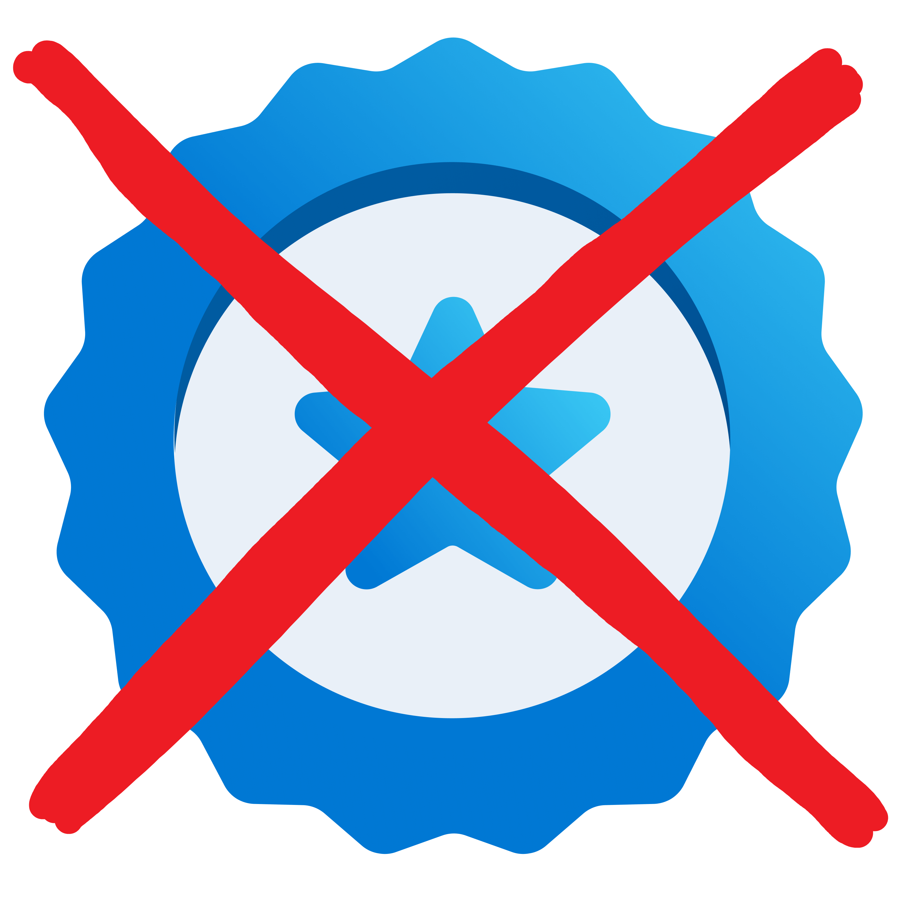

# New Microsoft One Day Trainings

Recordings of Microsoft Trainings on YouTube see below.

|                                      |                        |
| ------------------------------------ | ---------------------- |
|  | Assessment available   |
|  | Assessment offline     |
|  | Assessment coming soon |
| [APL]()                              | Prepare for the assessment / take the assessment |

 

➡️ [Browse the full list of Applied Skills](https://learn.microsoft.com/en-us/credentials/browse/?credential_types=applied%20skills) ⬅️
 
 

|                                                      |         | Learning Path                                                                                      | Labs                                     |
| -----------------------------------------------------| ------- | -------------------------------------------------------------------------------------------------- |------------------------------------------|
| **Retired!**                                         |  AI-050 | [Develop generative AI solutions with Azure OpenAI Service][050 LP]                                | [Repo][050 Repo]    [HTML][050 HTML]  |
| [APL][3002 APL]  | AI-3002 | [Create an intelligent document processing solution with Azure AI Document Intelligence][3002 LP]  | [Repo][3002 Repo]   [HTML][3002 HTML] |
| [APL][3003 APL]  | AI-3003 | [Build a natural language processing solution with Azure AI Language][3003 LP]                     | [Repo][3003 Repo]   [HTML][3003 HTML] |
| [APL][3004 APL]  | AI-3004 | [Build an Azure AI Vision solution][3004 LP]                                                       | [Repo][3004 Repo]   [HTML][3004 HTML] |
|                  | AI-3016 | [Develop generative AI apps in Azure AI Foundry][3016 LP]                                          | [Repo][3016 Repo]   [HTML][3016 HTML] |
|                                                      | AI-3017 | [Microsoft AI for business leaders][3017 LP]                                                       |                                          |
| **Retired!**                                         | AI-3018 | [Copilot Foundations][3018 LP]                                                                     |                                          |
| [APL][3019 APL]  | AI-3019 | [Build AI Apps with Azure Database for PostgreSQL][3019 LP]                                        | [Repo][3019 Repo]   [HTML][3019 HTML] |
|                  | AI-3022 | [ Implement AI Skills in Azure AI Search][3022 LP]                                                 |                                          |
|                                                      | AI-3024 | [Design a dream destination with AI][3024 LP]                                                      |                                          |
|                                                      | AI-3025 | [Work smarter with AI][3025 LP]                                                                    |                                          |
|                                                      | AI-3026 | [Develop AI agents on Azure][3026 LP]                                                              |                                          |
| **Retired!**                                         | AZ-1001 | [Deploy containers by using Azure Kubernetes Service][1001 LP]                                     | [Repo][1001 Repo]   [HTML][1001 HTML] |
| [APL][1002 APL]  | AZ-1002 | [Configure secure access to your workloads using Azure networking][1002 LP]                        | [Repo][1002 Repo]   [HTML][1002 HTML] |
| [APL][1003 APL]  | AZ-1003 | [Secure storage for Azure Files and Azure Blob Storage][1003 LP]                                   | [Repo][1003 Repo]   [HTML][1003 HTML] |
| [APL][1004 APL]  | AZ-1004 | [Deploy and configure Azure Monitor][1004 LP]                                                      | [Repo][1004 Repo]   [HTML][1004 HTML] |
| **Retired!**                                         | AZ-1005 | Configuring Azure Virtual Desktop for the Enterprise (See course [AZ-140](https://learn.microsoft.com/en-us/training/courses/az-140t00)) |    |
|                                                      | AZ-1006 | [Migrate and modernize SAP in the Microsoft Cloud][1006 LP]                                        |                                          |
| [APL][1007 APL]  | AZ-1007 | [Deploy and administer Linux virtual machines on Azure][1007 LP]                                   | [Repo][1007 Repo]   [HTML][1007 HTML] |
| [APL][1008 APL]  | AZ-1008 | [Administer Active Directory Domain Services][1008 LP]                                             | [Repo][1008 Repo]   [HTML][1008 HTML] |
| [APL][1010 APL]  | AZ-1010 | [Deploy and manage Microsoft Azure Arc-enabled servers][1010 LP]                                   | [Repo][1010 Repo]                        |
| [APL][2001 APL]  | AZ-2001 | [Implement security through a pipeline using Azure DevOps][2001 LP]                                | [Repo][2001 Repo]   [HTML][2001 HTML] |
| [APL][2002 APL]  | AZ-2002 | [Develop an ASP.NET Core web app that consumes an API][2002 LP]                                    | [Repo][2002 Repo]   [HTML][2002 HTML] |
| [APL][2003 APL]  | AZ-2003 | [Deploy cloud-native applications using Azure Container Apps][2003 LP]                             | [Repo][2003 Repo]   [HTML][2003 HTML] |
| [APL][2005 APL]  | AZ-2005 | [Develop AI agents using Azure OpenAI and the Semantic Kernel SDK][2005 LP]                        | [Repo][2005 Repo]                        |
|                  | AZ-2006 | [Automate Azure Load Testing by using GitHub][2006 LP]                                             | [Repo][2006 Repo]   [HTML][2006 HTML] |
|                                                      | AZ-2007 | [Accelerate app development by using GitHub Copilot][2007 LP]                                      | [Repo][2007 Repo]                        |
|                                                      | AZ-2008 | [DevOps Foundations: The Core Principles and Practices][2008 LP]                                   | [Repo][2008 Repo]   [HTML][2008 HTML] |
| **Retired!**                                         | AZ-2009 | [Build distributed apps with .NET Aspire][2009 LP]                                                 |                                          |
|                                                      | AZ-2010 | [Designing and Implementing Platform Engineering][2010 LP]                                         |                                          |
| [APL][3001 APL]  | DP-3001 | [Migrate SQL Server workloads to Azure SQL Database][3001 LP]                                      | [Repo][3001 Repo]   [HTML][3001 HTML] |
| **Retired!**                                         | DP-3007 | [Train and deploy a machine learning model with Azure Machine Learning][3007 LP]                   | [Repo][3007 Repo]   [HTML][3007 HTML] |
|                                                      | DP-3011 | [Implementing a Data Analytics Solution with Azure Databricks][3011 LP]                            |                                          |
|                                                      | DP-3012 | [Implementing a Data Analytics Solution with Synapse Analytics][3012 LP]                           |                                          |
|                                                      | DP-3014 | [Implementing a Machine Learning Solution with Azure Databricks][3014 LP]                          |                                          |
|                                                      | DP-3015 | [Getting Started with Cosmos DB NoSQL Development][3015 LP]                                        |                                          |
| [APL][3020 APL]  | DP-3020 | [Develop data-driven applications with Azure SQL Database][3020 LP]                                |                                          |
|                  | DP-3021 | [Configure and migrate to Azure Database for PostgreSQL][3021 LP]                                  |                                          |
| [APL][601 APL]   | DP-601  | [Implement a lakehouse in Microsoft Fabric][601 LP]                                                |                                          |
| [APL][602 APL]   | DP-602  | [Implement a data warehouse in Microsoft Fabric][602 LP]                                           |                                          |
| [APL][603 APL]   | DP-603  | [Implement a Real-Time Intelligence solution with Microsoft Fabric][603 LP]                        |                                          |
| [APL][604 APL]   | DP-604  | [Implement a data science and machine learning solution with Microsoft Fabric][604 LP]             |                                          |
|                                                      | DP-605  | [Develop dynamic reports with Microsoft Power BI][605 LP]                                          |                                          |
|                                                      | GH-100  | [GitHub fundamentals - Administration basics and product features][GH-100 LP]                      |                                          |
|                                                      | GH-200  | Automate your workflow with GitHub Actions                                                         |                                          |
|                                                      | GH-300  | [GitHub Copilot][GH-300 LP]                                                                        |                                          |
|                                                      | GH-500  | [GitHub Advanced Security][GH-500 LP]                                                              |                                          |
|                                                      | GH-900  | [GitHub Foundations][GH-900 LP]                                                                    |                                          |
|                                                      | MB-7005 | [Create and manage journeys with Dynamics 365 Customer Insights][7005 LP]                          |                                          |
|                                                      | MB-7006 | [Create and manage segments in Customer Insights - Data][7006 LP]                                  |                                          |
|                  | MB-7007 | Deploy and configure Microsoft 365 Copilot for Sales                                               |                                          |
|                                                      | MD-4011 | [Enhance Endpoint Security with Microsoft Intune and Microsoft Copilot for Security][4011 LP]      |                                          |
| **Retired!**                                         | MS-4001 | [Build collaborative apps for Microsoft Teams][4001 LP]                                            | [Repo][4001 Repo]   [HTML][4001 HTML] |
| [APL][4002 APL]  | MS-4002 | [Prepare security and compliance to support Microsoft 365 Copilot][4002 LP]                        | [Repo][4002 Repo]                        |
|                                                      | MS-4004 | [Empower your workforce with Copilot for Microsoft 365 Use Cases][4004 LP]                         | [Repo][4004 Repo]                        |
|                                                      | MS-4005 | [Craft effective prompts for Microsoft Copilot for Microsoft 365][4005 LP]                         | [Repo][4005 Repo]                        |
| **Retired!**                                         | MS-4006 | Copilot for Microsoft 365 for Administrators (replaced by MS-4017)                                 |                                          |
|                                                      | MS-4007 | [Copilot for Microsoft 365 User Enablement Specialist][4007 LP]                                    |                                          |
|                                                      | MS-4008 | [Copilot for Microsoft 365 Interactive Experience for Executives (paid)][4008 LP]                  | [Repo][4008 Repo]                        |
| **Retired!**                                         | MS-4009 | [Extend Microsoft Copilot for Microsoft 365 with Copilot Studio][4009 LP] replaced by MS-4022      | [Repo][4009 Repo]                        |
|                                                      | MS-4010 | [Extend Microsoft 365 Copilot with declarative agents by using Visual Studio Code][4010 LP]        | [Repo][4010 Repo]                        |
|                                                      | MS-4012 | [Microsoft Copilot Interactive Experience for Executives (free)][4012 LP]                          | [Repo][4012 Repo]                        |
|                                                      | MS-4014 | [Build a foundation to extend Microsoft 365 Copilot][4014 LP]                                      | [Repo][4014 Repo]                        |
|                                                      | MS-4015 | [Build custom engine copilots for Microsoft Teams][4015 LP]                                        | [Repo][4015 Repo]                        |
|                                                      | MS-4017 | [Manage and extend Microsoft 365 Copilot][4017 LP]                                                 |                                          |
|                                                      | MS-4018 | [Draft, analyze, and present with Microsoft 365 Copilot][4018 LP]                                  |                                          |
|                                                      | MS-4019 | [Transform your everyday business processes with agents][4019 LP]                                  |                                          |
|                                                      | MS-4020 | Redefine your workflow with Microsoft 365 Copilot                                                  |                                          |
|                                                      | MS-4021 | Copilot Immersion Experience                                                                       |                                          |
|                                                      | MS-4022 | [Extend Microsoft 365 Copilot in Copilot Studio][4022 LP]                                          |                                          |
|                                                      | MS-4023 | [Explore Microsoft 365 Copilot Chat][4023 LP]                                                      |                                          |
| [APL][7001 APL]  | PL-7001 | [Create and manage canvas apps with Power Apps][7001 LP]                                           | [Repo][7001 Repo]                        |
| [APL][7002 APL]  | PL-7002 | [Create and manage automated processes by using Power Automate][7002 LP]                           | [Repo][7002 Repo]                        |
| [APL][7003 APL]  | PL-7003 | [Create and manage model-driven apps with PowerApps and Dataverse][7003 LP]                        | [Repo][7003 Repo]                        |
| [APL][7004 APL]  | PL-7004 | [Implement AI models with Microsoft Power Platform AI Builder][7004 LP]                            | [Repo][7004 Repo]                        |
|                  | PL-7008 | [Create agents in Microsoft Copilot Studio][7008 LP]                                               |                                          |
| **Retired!**                                         | SC-5001 | [Configure SIEM security operations using Microsoft Sentinel][5001 LP]                             | [Repo][5001 Repo]   [HTML][5001 HTML] |
| [APL][5002 APL]  | SC-5002 | [Secure Azure services and workloads with Microsoft Defender for Cloud regulatory compliance controls][5002 LP] | [Repo][5002 Repo]   [HTML][5002 HTML] |
| [APL][5003 APL]  | SC-5003 | [Implement information protection and data loss prevention by using Microsoft Purview][5003 LP]    | [Repo][5003 Repo]   [HTML][5003 HTML] |
| [APL][5004 APL]  | SC-5004 | [Defend against threats with Microsoft Defender (XDR)][5004 LP]                                    | [Repo][5004 Repo]   [HTML][5004 HTML] |
|                                                      | SC-5006 | [Enhance security operations by using Microsoft Security Copilot][5006 LP]                         | [Repo][5006 Repo]                        |
| [APL][5007 APL]  | SC-5007 | [Implement retention, eDiscovery, and Communication compliance in Microsoft Purview][5007 LP]      | [Repo][5007 Repo]                        |
|                                                      | SC-5008 | [Configure and manage entitlement with Microsoft Entra ID][5008 LP]                                | [Repo][5008 Repo]                        |

updated on May 10, 2025 (Courseware titleplan April v2)

[050 LP]:   https://learn.microsoft.com/en-us/training/paths/develop-ai-solutions-azure-openai/
[050 APL]:  https://learn.microsoft.com/en-us/credentials/applied-skills/develop-generative-ai-solutions-with-azure-openai-service/
[050 Repo]: https://github.com/MicrosoftLearning/mslearn-openai/tree/main
[050 HTML]: https://microsoftlearning.github.io/mslearn-openai/

[1001 LP]:   https://learn.microsoft.com/training/paths/deploy-manage-containers-azure-kubernetes-service/
[1001 APL]:  https://learn.microsoft.com/credentials/applied-skills/deploy-containers-by-using-azure-kubernetes-service/
[1001 Repo]: https://github.com/MicrosoftLearning/deploy-and-manage-containers-with-azure-kubernetes-service
[1001 HTML]: https://github.com/MicrosoftLearning/deploy-and-manage-containers-with-azure-kubernetes-service/blob/master/Instructions/Labs/Complete%20Guided%20Exercise-Deploy%20Applications%20to%20AKS.md

[1002 LP]:   https://learn.microsoft.com/en-us/training/paths/configure-secure-workloads-using-azure-virtual-networking/
[1002 APL]:  https://learn.microsoft.com/en-us/credentials/applied-skills/configure-secure-workloads-use-azure-virtual-networking/
[1002 Repo]: https://github.com/MicrosoftLearning/Configure-secure-access-to-workloads-with-Azure-virtual-networking-services
[1002 HTML]: https://microsoftlearning.github.io/Configure-secure-access-to-workloads-with-Azure-virtual-networking-services/

[1003 LP]:   https://learn.microsoft.com/en-us/training/paths/implement-storage-azure-files-azure-blob-storage/
[1003 APL]:  https://learn.microsoft.com/en-us/credentials/applied-skills/secure-storage-azure-files-azure-blob-storage/
[1003 Repo]: https://github.com/MicrosoftLearning/Secure-storage-for-Azure-Files-and-Azure-Blob-Storage
[1003 HTML]: https://microsoftlearning.github.io/Secure-storage-for-Azure-Files-and-Azure-Blob-Storage/

[1004 LP]:   https://learn.microsoft.com/en-us/training/paths/deploy-configure-azure-monitor/
[1004 APL]:  https://learn.microsoft.com/en-us/credentials/applied-skills/deploy-and-configure-azure-monitor/
[1004 Repo]: https://github.com/MicrosoftLearning/APL-1004-deploy-configure-azure-monitor
[1004 HTML]: https://microsoftlearning.github.io/APL-1004-deploy-configure-azure-monitor/

[1006 LP]:   https://learn.microsoft.com/en-us/training/courses/az-1006

[1007 LP]:   https://learn.microsoft.com/training/paths/deploy-administer-linux-virtual-machines-azure/
[1007 APL]:  https://learn.microsoft.com/en-us/credentials/applied-skills/deploy-and-administer-linux-virtual-machines-on-microsoft-azure/
[1007 Repo]: https://github.com/MicrosoftLearning/Deploy-and-administer-Linux-virtual-machines-in-Azure
[1007 HTML]: https://microsoftlearning.github.io/Deploy-and-administer-Linux-virtual-machines-in-Azure/

[1008 LP]:   https://learn.microsoft.com/training/paths/administer-active-directory-domain-services/
[1008 APL]:  https://learn.microsoft.com/en-us/credentials/applied-skills/administer-active-directory-domain-services/#applied-skill-take-the-assessment
[1008 Repo]: https://github.com/MicrosoftLearning/AZ-1008-Administer-Active-Directory-Domain-Services
[1008 HTML]: https://microsoftlearning.github.io/AZ-1008-Administer-Active-Directory-Domain-Services/

[1010 LP]:    https://learn.microsoft.com/training/paths/deploy-manage-azure-arc-enabled-servers/
[1010 APL]:   https://learn.microsoft.com/credentials/applied-skills/deploy-and-manage-microsoft-azure-arc-enabled-servers/
[1010 Repo]:  https://github.com/MicrosoftLearning/Deploy-and-manage-Azure-Arc-enabled-Servers

[2001 LP]:   https://learn.microsoft.com/en-us/training/paths/implement-security-through-pipeline-using-devops/
[2001 APL]:  https://learn.microsoft.com/en-us/credentials/applied-skills/implement-security-through-pipeline-using-devops/
[2001 Repo]: https://github.com/MicrosoftLearning/implement-security-through-pipeline-using-devops
[2001 HTML]: https://microsoftlearning.github.io/implement-security-through-pipeline-using-devops/

[2002 LP]:   https://learn.microsoft.com/en-us/training/paths/develop-asp-core-api/
[2002 APL]:  https://learn.microsoft.com/en-us/credentials/applied-skills/develop-an-aspnet-core-web-app-that-consumes-an-api/
[2002 Repo]: https://github.com/MicrosoftLearning/APL-2002-develop-aspnet-core-consumes-api
[2002 HTML]: https://microsoftlearning.github.io/APL-2002-develop-aspnet-core-consumes-api/

[2003 LP]:   https://learn.microsoft.com/en-us/training/paths/deploy-cloud-native-applications-to-azure-container-apps/
[2003 APL]:  https://learn.microsoft.com/en-us/credentials/applied-skills/deploy-cloud-native-apps-using-azure-container-apps/
[2003 Repo]: https://github.com/MicrosoftLearning/az-2003-deploy-cloud-native-applications-using-azure-container-apps
[2003 HTML]: https://microsoftlearning.github.io/az-2003-deploy-cloud-native-applications-using-azure-container-apps/

[2005 LP]:   https://learn.microsoft.com/en-us/training/paths/develop-ai-agents-azure-open-ai-semantic-kernel-sdk/
[2005 APL]:  https://learn.microsoft.com/en-us/credentials/applied-skills/develop-ai-agents-using-microsoft-azure-openai-and-semantic-kernel/
[2005 Repo]: https://github.com/MicrosoftLearning/AZ-2005-Develop-AI-agents-OpenAI-Semantic-Kernel-SDK

[2006 LP]:   https://learn.microsoft.com/en-us/training/paths/automate-azure-load-testing-github/
[2006 Repo]: https://github.com/MicrosoftLearning/AZ-2006-automate-azure-loadtesting-github-actions
[2006 HTML]: https://microsoftlearning.github.io/AZ-2006-automate-azure-loadtesting-github-actions/

[2007 LP]:   https://learn.microsoft.com/en-us/training/paths/accelerate-app-development-using-github-copilot/
[2007 Repo]: https://github.com/MicrosoftLearning/AZ-2007-Accelerate-app-development-by-using-GitHub-Copilot

[2008 LP]:   https://learn.microsoft.com/en-us/training/paths/devops-foundations-core-principles-practices/
[2008 Repo]: https://github.com/MicrosoftLearning/AZ-2008_DevOps_Foundations_Core_Principles_Practices
[2008 HTML]: https://microsoftlearning.github.io/AZ-2008_DevOps_Foundations_Core_Principles_Practices/

[2009 LP]:   https://learn.microsoft.com/en-us/training/paths/dotnet-aspire/
[2009 APL]:  https://learn.microsoft.com/en-us/credentials/applied-skills/build-distributed-apps-with-dotnet-aspire/

[2010 LP]:   https://learn.microsoft.com/en-us/training/paths/designing-implementing-platform-engineering/

[3001 LP]:   https://learn.microsoft.com/en-us/training/paths/migrate-sql-workloads-azure/
[3001 APL]:  https://learn.microsoft.com/en-us/credentials/applied-skills/migrate-sql-workloads-azure-sql-database/
[3001 Repo]: https://github.com/MicrosoftLearning/mslearn-sql-migration
[3001 HTML]: https://microsoftlearning.github.io/mslearn-sql-migration/

[3002 LP]:   https://learn.microsoft.com/en-us/training/paths/extract-data-from-forms-document-intelligence/
[3002 APL]:  https://learn.microsoft.com/en-us/credentials/applied-skills/create-intelligent-document-solution-azure-ai/
[3002 Repo]: https://github.com/MicrosoftLearning/mslearn-ai-document-intelligence
[3002 HTML]: https://microsoftlearning.github.io/mslearn-ai-document-intelligence

[3003 LP]:   https://learn.microsoft.com/en-us/training/paths/develop-language-solutions-azure-ai/
[3003 APL]:  https://learn.microsoft.com/en-us/credentials/applied-skills/build-natural-language-solution-azure-ai/
[3003 Repo]: https://github.com/MicrosoftLearning/mslearn-ai-language
[3003 HTML]: https://microsoftlearning.github.io/mslearn-ai-language

[3004 LP]:   https://learn.microsoft.com/en-us/training/paths/create-computer-vision-solutions-azure-ai/
[3004 APL]:  https://learn.microsoft.com/en-us/credentials/applied-skills/build-azure-ai-vision-solution/
[3004 Repo]: https://github.com/MicrosoftLearning/mslearn-ai-vision
[3004 HTML]: https://microsoftlearning.github.io/mslearn-ai-vision/

[3007 LP]:   https://learn.microsoft.com/en-us/training/paths/train-deploy-machine-learning-model/
[3007 APL]:  https://learn.microsoft.com/en-us/credentials/applied-skills/train-and-deploy-a-machine-learning-model-with-azure-machine-learning/
[3007 Repo]: https://github.com/MicrosoftLearning/mslearn-azure-ml
[3007 HTML]: https://microsoftlearning.github.io/mslearn-azure-ml/Instructions/11-Deploy-online-endpoint.html

[3011 LP]:   https://learn.microsoft.com/en-us/training/paths/data-engineer-azure-databricks/

[3012 LP]:   https://learn.microsoft.com/en-us/training/courses/DP-3012

[3014 LP]:   https://learn.microsoft.com/en-us/training/paths/build-operate-machine-learning-solutions-azure-databricks/

[3015 LP]:   https://learn.microsoft.com/en-us/training/courses/dp-3015

[3016 LP]:   https://learn.microsoft.com/training/paths/create-custom-copilots-ai-studio/
[3016 Repo]: https://github.com/MicrosoftLearning/mslearn-ai-studio/tree/main
[3016 HTML]: https://microsoftlearning.github.io/mslearn-ai-studio/

[3017 LP]:   https://learn.microsoft.com/training/paths/transform-your-business-with-microsoft-ai/

[3018 LP]:   https://learn.microsoft.com/training/paths/copilot-foundations/

[3019 LP]:   https://learn.microsoft.com/training/paths/build-ai-apps-azure-database-postgresql/
[3019 APL]:  https://learn.microsoft.com/en-us/credentials/applied-skills/build-ai-powered-solutions-by-using-microsoft-azure-database-for-postgresql/
[3019 Repo]: https://github.com/MicrosoftLearning/mslearn-postgresql/
[3019 HTML]: https://microsoftlearning.github.io/mslearn-postgresql/

[3020 LP]:   https://learn.microsoft.com/en-us/training/paths/develop-data-driven-app-sql-db/
[3020 APL]:  https://learn.microsoft.com/en-us/credentials/applied-skills/develop-data-driven-applications-by-using-microsoft-azure-sql-database/

[3021 LP]:   https://learn.microsoft.com/training/paths/microsoft-learn-azure-database-for-postgresql/

[3022 LP]:   https://learn.microsoft.com/en-us/training/paths/implement-knowledge-mining-azure-cognitive-search/

[3024 LP]:   https://learn.microsoft.com/training/paths/design-dream-destination-ai

[3025 LP]:   https://learn.microsoft.com/training/paths/work-smarter-with-ai/

[3026 LP]:   https://learn.microsoft.com/en-us/training/paths/develop-ai-agents-on-azure/

[601 LP]:    https://learn.microsoft.com/en-us/training/paths/implement-lakehouse-microsoft-fabric/
[601 APL]:   https://learn.microsoft.com/en-us/credentials/applied-skills/implement-lakehouse-microsoft-fabric/

[602 LP]:    https://learn.microsoft.com/en-us/training/paths/work-with-data-warehouses-using-microsoft-fabric/
[602 APL]:   https://learn.microsoft.com/en-us/credentials/applied-skills/work-with-data-warehouses-using-microsoft-fabric/

[603 LP]:    https://learn.microsoft.com/en-us/training/paths/explore-real-time-analytics-microsoft-fabric/
[603 APL]:   https://learn.microsoft.com/en-us/credentials/applied-skills/implement-a-real-time-intelligence-solution-with-microsoft-fabric/

[604 LP]:    https://learn.microsoft.com/en-us/training/paths/implement-data-science-machine-learning-fabric/
[604 APL]:   https://learn.microsoft.com/en-us/credentials/applied-skills/implement-a-data-science-and-machine-learning-solution-with-microsoft-fabric/

[605 LP]:    https://learn.microsoft.com/training/paths/develop-dynamic-reports-microsoft-power-bi

[4001 LP]:   https://learn.microsoft.com/en-us/training/paths/build-collaborative-apps-microsoft-teams/
[4001 APL]:  https://learn.microsoft.com/en-us/credentials/applied-skills/build-collaborative-apps-microsoft-teams/
[4001 Repo]: https://github.com/MicrosoftLearning/MS-4001-Build-collaborative-apps-for-Microsoft-Teams
[4001 HTML]: https://microsoftlearning.github.io/MS-4001-Build-collaborative-apps-for-Microsoft-Teams/

[4002 LP]:   https://learn.microsoft.com/training/paths/prepare-security-compliance-support-microsoft-365-copilot/
[4002 APL]:  https://learn.microsoft.com/en-us/credentials/applied-skills/prepare-security-and-compliance-to-support-microsoft-365-copilot/
[4002 Repo]: https://github.com/MicrosoftLearning/MS-4002-Prepare-security-and-compliance-to-support-Microsoft-365-Copilot

[4004 LP]:   https://learn.microsoft.com/en-us/training/paths/empower-workforce-copilot-use-cases/
[4004 Repo]: https://github.com/MicrosoftLearning/MS-4004-Empower-workforce-copilot-use-cases

[4005 LP]:   https://learn.microsoft.com/en-us/training/paths/craft-effective-prompts-copilot-microsoft-365/
[4005 Repo]: https://github.com/MicrosoftLearning/MS-4005-Craft-effective-prompts-for-Microsoft-Copilot-for-Microsoft-365/

[4007 LP]:   https://learn.microsoft.com/en-us/training/paths/explore-how-drive-adoption-microsoft-copilot-m365/

[4008 LP]:   https://learn.microsoft.com/en-us/training/paths/microsoft-copilot-for-microsoft-365-executive-challenge/
[4008 Repo]: https://github.com/MicrosoftLearning/MS-4008-Microsoft-365-Copilot-Interactive-Experience-for-Executives

[4009 LP]:   https://learn.microsoft.com/training/paths/extend-microsoft-copilot-microsoft-365-copilot-studio/
[4009 Repo]: https://github.com/MicrosoftLearning/MS-4009-Extend-Microsoft-Copilot-for-Microsoft-365-with-Copilot-Studio

[4010 LP]:   https://learn.microsoft.com/en-us/training/paths/build-plugins-connectors-microsoft-copilot-microsoft-365/
[4010 Repo]: https://github.com/MicrosoftLearning/MS-4010-Build-Plugins-Connectors-Microsoft-Copilot-M365

[4011 LP]:   https://learn.microsoft.com/training/paths/enhance-endpoint-security-microsoft-intune-copilot/

[4012 LP]:   https://learn.microsoft.com/training/paths/microsoft-copilot-web-based-interactive-experience-executives/
[4012 Repo]: https://github.com/MicrosoftLearning/MS-4012-Microsoft-Copilot-Web-Based-Interactive-Experience-for-Executives

[4014 LP]:   https://learn.microsoft.com/en-us/training/paths/build-foundation-extend-microsoft-365-copilot/
[4014 Repo]: https://github.com/MicrosoftLearning/MS-4014-Build-a-foundation-to-extend-Microsoft-365-Copilot

[4015 LP]:   https://learn.microsoft.com/en-us/training/paths/build-custom-copilots-microsoft-teams/
[4015 Repo]: https://github.com/MicrosoftLearning/MS-4015-Build-Custom-Agent-for-Microsoft-Teams

[4017 LP]:   https://learn.microsoft.com/training/courses/MS-4017

[4018 LP]:   https://learn.microsoft.com/en-us/training/paths/draft-analyze-present-microsoft-365-copilot/

[4019 LP]:   https://learn.microsoft.com/en-us/training/paths/implement-no-code-copilot-agents-microsoft-365-sharepoint/

[4022 LP]:   https://learn.microsoft.com/en-us/training/paths/extend-microsoft-365-copilot-studio/

[4023 LP]:   https://learn.microsoft.com/training/paths/explore-microsoft-365-copilot-business-chat/

[5001 LP]:   https://learn.microsoft.com/en-us/training/paths/configure-security-information-event-management-operations-using-microsoft-sentinel/
[5001 APL]:  https://learn.microsoft.com/en-us/credentials/applied-skills/configure-siem-security-operations-using-microsoft-sentinel/
[5001 Repo]: https://github.com/MicrosoftLearning/APL-5001-configure-siem-security-operations-using-microsoft-sentinel
[5001 HTML]: https://microsoftlearning.github.io/APL-5001-configure-siem-security-operations-using-microsoft-sentinel/

[5002 LP]:   https://learn.microsoft.com/en-us/training/paths/secure-azure-services-workloads-defender-cloud/
[5002 APL]:  https://learn.microsoft.com/en-us/credentials/applied-skills/secure-azure-services-and-workloads-with-microsoft-defender-for-cloud-regulatory-compliance-controls/
[5002 Repo]: https://github.com/MicrosoftLearning/Secure-Azure-with-Microsoft-Defender-Cloud-Compliance-Controls
[5002 HTML]: https://microsoftlearning.github.io/Secure-Azure-with-Microsoft-Defender-Cloud-Compliance-Controls/

[5003 LP]:   https://learn.microsoft.com/en-us/training/paths/purview-implement-information-protection-data-loss-prevention/
[5003 APL]:  https://learn.microsoft.com/en-us/credentials/applied-skills/implement-information-protection-and-data-loss-prevention-by-using-microsoft-purview/
[5003 Repo]: https://github.com/MicrosoftLearning/SC-5003_Information-protection-and-Data-Loss-Prevention
[5003 HTML]: https://microsoftlearning.github.io/SC-5003_Information-protection-and-Data-Loss-Prevention/

[5004 LP]:   https://learn.microsoft.com/en-us/training/paths/sc-5004-defend-against-cyberthreats-defender/
[5004 APL]:  https://learn.microsoft.com/en-us/credentials/applied-skills/defend-against-cyberthreats-with-microsoft-defender-xdr/
[5004 Repo]: https://github.com/MicrosoftLearning/Defend-against-cyberthreats-Microsoft-Defender-XDR
[5004 HTML]: https://microsoftlearning.github.io/Defend-against-cyberthreats-Microsoft-Defender-XDR/

[5006 LP]:   https://learn.microsoft.com/en-us/training/paths/security-copilot-and-ai/
[5006 Repo]: https://github.com/MicrosoftLearning/SC-5006-Enhance-security-by-Microsoft-Security-Copilot

[5007 LP]:   https://learn.microsoft.com/training/paths/purview-implement-retention-ediscovery-communication-compliance/
[5007 APL]:  https://learn.microsoft.com/en-us/credentials/applied-skills/implement-retention-ediscovery-and-communication-compliance-in-microsoft-purview/
[5007 Repo]: https://github.com/MicrosoftLearning/SC-5007-Implement-retention-eDiscovery-and-Communication-compliance-in-Microsoft-Purview

[5008 LP]:   https://learn.microsoft.com/en-us/training/paths/configure-manage-entitlement-microsoft-entra-id/
[5008 Repo]: https://github.com/MicrosoftLearning/SC-5008-Configure-and-manage-entitlement-with-Microsoft-Entra-ID

[7001 LP]:   https://learn.microsoft.com/en-us/training/paths/create-manage-canvas-apps-power-apps/
[7001 APL]:  https://learn.microsoft.com/en-us/credentials/applied-skills/create-manage-canvas-apps-power-apps/
[7001 Repo]: https://github.com/MicrosoftLearning/PL-7001-Create-and-manage-canvas-apps-with-Power-Apps

[7002 LP]:   https://learn.microsoft.com/en-us/training/paths/create-manage-automated-processes-by-using-power-automate/
[7002 APL]:  https://learn.microsoft.com/en-us/credentials/applied-skills/create-and-manage-automated-processes-with-power-automate/
[7002 Repo]: https://github.com/MicrosoftLearning/PL-7002-Create-and-Manage-Automated-Processes-by-using-Power-Automate

[7003 LP]:   https://learn.microsoft.com/en-us/training/paths/create-manage-model-driven-apps/   
[7003 APL]:  https://learn.microsoft.com/en-us/credentials/applied-skills/create-and-manage-model-driven-apps-with-power-apps-and-dataverse/   
[7003 Repo]: https://github.com/MicrosoftLearning/PL-7003-Create-and-manage-model-driven-apps-with-Power-Apps-and-Dataverse

[7004 LP]:   https://learn.microsoft.com/en-us/training/paths/implement-ai-models-microsoft-power-platform-ai-builder/
[7004 APL]:  https://learn.microsoft.com/en-us/credentials/applied-skills/implement-ai-models-with-microsoft-power-platform-ai-builder/
[7004 Repo]: https://github.com/MicrosoftLearning/PL-7004-Implement-AI-models-with-Platform-AI-Builder

[7005 LP]:   https://learn.microsoft.com/en-us/training/paths/create-manage-journeys-dynamics-365-customer-insights/

[7006 LP]:   https://learn.microsoft.com/en-us/training/paths/create-manage-segments-d365-customer-insights-data/

[7008 LP]:   https://learn.microsoft.com/training/paths/create-extend-custom-copilots-microsoft-copilot-studio/

[GH-100 LP]: https://learn.microsoft.com/en-us/training/courses/gh-100t00
[GH-300 LP]: https://learn.microsoft.com/en-us/training/courses/gh-300t00
[GH-500 LP]: https://learn.microsoft.com/en-us/training/courses/gh-500t00
[GH-900 LP]: https://learn.microsoft.com/en-us/training/courses/gh-900t00

 
 
 
 

# Recordings of Microsoft Trainings on YouTube

## MS-4017 Manage and extend Microsoft 365 Copilot ([Course](https://learn.microsoft.com/en-us/training/courses/MS-4017))

### LP1 Prepare your organization for Microsoft 365 Copilot

[LP1 Module 1 Implement Microsoft Copilot](https://www.youtube.com/watch?v=pMWkmqqbXdw)  [11:50]

[LP1 Module 2 Examine data security and compliance in Microsoft 365 Copilot](https://www.youtube.com/watch?v=157VFSwWIbg) [7:48]

### LP2 Manage Microsoft 365 Copilot administration

[LP2 Module 1 Apply principles of Zero Trust to Microsoft 365 Copilot](https://www.youtube.com/watch?v=NCp-m4MFu9U) [22:38]

[LP2 Module 2 Manage Microsoft Copilot](https://www.youtube.com/watch?v=XrdKUuMINAs) [9:24]

[LP2 Module 3 Manage Microsoft 365 Copilot](https://www.youtube.com/watch?v=Gbc3OANG0Us) [22:45]

### LP3 Prepare for Microsoft 365 Copilot extensibility

[LP3 Module 1 Microsoft Copilot extensibility fundamentals](https://www.youtube.com/watch?v=lEpx-gHwZlo) [28:13]

[LP3 Module 2 Microsoft 365 Copilot Extensibility Development Paths](https://www.youtube.com/watch?v=famR2Hll0J4) [16:04]

[LP3 Module 3 Manage Microsoft 365 Copilot extensibility](https://www.youtube.com/watch?v=PknOS8VsW2U) [10:02]

 
 

## AZ-2007 Accelerate app development by using GitHub Copilot ([LP](https://learn.microsoft.com/en-us/training/paths/accelerate-app-development-using-github-copilot/))

[Module 1 Get started with GitHub Copilot](https://www.youtube.com/watch?v=7FDrdrGQ1Oc) [29:46]

[Module 2 Generate documentation using GitHub Copilot tools](https://www.youtube.com/watch?v=ZBuRK-64JeI) [42:17]

[Module 3 Develop code features using GitHub Copilot tools](https://www.youtube.com/watch?v=hYbG7quFAfY) [48:38]

[Module 4 Develop unit tests using GitHub Copilot tools](https://www.youtube.com/watch?v=CbssDK-1BXM) [34:41]

[Module 5 Implement code improvements using GitHub Copilot tools](https://www.youtube.com/watch?v=4-zs2g2XcNU) [41:45]

 
 

## MD-4011 Enhance endpoint security with Microsoft Intune and Microsoft Copilot for Security ([LP](https://learn.microsoft.com/en-us/training/paths/enhance-endpoint-security-microsoft-intune-copilot/))

[Course Introduction](https://www.youtube.com/watch?v=qk5UWS29pgw) [3:09]

[Module 1 Discover Microsoft Intune essentials](https://www.youtube.com/watch?v=e-moW6rVvik) [18:04]

[Module 2 Unlock Insights with Microsoft Copilot for Security](https://www.youtube.com/watch?v=xKyI4JvmuZw) [29:45]

[Module 3 Optimize Microsoft Intune for Microsoft Copilot for Security Integration](https://www.youtube.com/watch?v=cWeGSHq4leQ) [26:34]

[Course Conclusion](https://www.youtube.com/watch?v=X-J5Ba_TQO8) [2:53]

 
 

## MS-4010 Build plugins and connectors for Microsoft 365 Copilot ([LP](https://learn.microsoft.com/en-us/training/paths/build-plugins-connectors-microsoft-copilot-microsoft-365/))

This course was renamed and rewritten by April 12, 2025. New title: *Extend Microsoft 365 Copilot with declarative agents by using Visual Studio Code*. The videos are a mix of old and new versions.

[Course Introduction](https://www.youtube.com/watch?v=_pqRyUhyGcU) [2:10]

[Module 1 Copilot extensibility fundamentals](https://www.youtube.com/watch?v=qyUTEhI91Yo) [39:05]

[Module 2 Choose a Microsoft 365 Copilot Extensibility Development Path](https://www.youtube.com/watch?v=ARPj2XpkCpU) [32:27]

[Introduction to declarative agents for Microsoft 365 Copilot](https://www.youtube.com/watch?v=kmZYztekuuQ) [13:32]

[Lab 1 Build a declarative agent for Microsoft 365 Copilot using Visual Studio Code](https://www.youtube.com/watch?v=2VPAPMOfeZc) [17:36]

[Lab 2 Build your first action for declarative agents with API plugin by using Visual Studio Code](https://www.youtube.com/watch?v=692C_5Z6Wtg) [20:19]

[Lab 3 Use Adaptive Cards to show data in API plugins for declarative agents](https://www.youtube.com/watch?v=jrVPfkdNXd4) [8:17]

[Course Summary](https://www.youtube.com/watch?v=vDtsvm1H0q0) [7:46]

 
 

## MS-4014 Build a foundation to extend Microsoft 365 Copilot ([LP](https://learn.microsoft.com/en-us/training/paths/build-foundation-extend-microsoft-365-copilot/))

[Course Introduction](https://www.youtube.com/watch?v=TqGXJY9rkjQ) [5:41]

[Course Introduction 2](https://www.youtube.com/watch?v=aDGgykQ7Sbo) [3:13]

[Module 1 Examine the Microsoft 365 Copilot design](https://www.youtube.com/watch?v=DDKgeW8hy1Q) [9:36]

[Module 2 Microsoft 365 Copilot extensibility fundamentals](https://www.youtube.com/watch?v=2Qe7vQ4TuZI) [15:36]

[Module 3 Choose a Microsoft 365 Copilot extensibility development path](https://www.youtube.com/watch?v=yOxLnF4xe2I) [23:12]

[Module 4 Introduction to Graph connectors](https://www.youtube.com/watch?v=EiZAuTKhjbM) [25:12]

[Module 5 Introduction to declarative agents for Microsoft 365 Copilot](https://www.youtube.com/watch?v=fEXxMSwuDpI) [15:14]

[Module 6 Manage agents for Microsoft 365 Copilot](https://www.youtube.com/watch?v=D-AVeZWT8n4) [13:43]

 
 

## AI-900 Microsoft Azure AI Fundamentals ([Course](https://learn.microsoft.com/en-us/training/courses/ai-900t00))

[Module 1 Fundamentals of Artificial Intelligence](https://www.youtube.com/watch?v=Minz9XZpxzE) [26:32]

[Module 2 Fundamentals of Computer Vision](https://www.youtube.com/watch?v=B_8kKi4vwFE) [10:51]

[Module 3 Fundamentals of Natural Language Processing](https://www.youtube.com/watch?v=jvIMQGX9CmE) [16:47]

[Module 4 Fundamentals of Document Intelligence and Knowledge Mining with Azure AI Search](https://www.youtube.com/watch?v=0x5gVyV7oqo) [14:39]

[Module 5 Fundamentals of Generative AI](https://www.youtube.com/watch?v=eXuttqLKwjo) [39:48]

 
 

## DP-100 Designing and implementing a data science solution on Azure ([Course](https://learn.microsoft.com/en-us/training/courses/dp-100t01))

[Module 1 Design a machine learning solution](https://www.youtube.com/watch?v=NKY1eEaM7p0) [29:27]

[Module 2 Explore and configure the Azure Machine Learning workspace](https://www.youtube.com/watch?v=_f5dlIvI5LQ) [1:23:43]

[Module 3 Experiment with Azure Machine Learning](https://www.youtube.com/watch?v=6E7FGbyySAQ) [29:51]

[Module 4 Optimize model training with Azure Machine Learning](https://www.youtube.com/watch?v=euxJTlSyv48&t=1117s) [54:07]

[Module 5 Optimize model training with Azure Machine Learning](https://www.youtube.com/watch?v=euxJTlSyv48&t=1117s) [39:22]

[Module 6 Deploy and consume models with Azure Machine Learning](https://www.youtube.com/watch?v=1_Il1CqyF0E&t=23s) [31:45]

 
 

## AI-3016 Develop generative AI apps in Azure AI Foundry ([LP](https://learn.microsoft.com/en-us/training/paths/create-custom-copilots-ai-studio/))

[Module 1 Introduction to Azure AI Studio](https://www.youtube.com/watch?v=boEuyJGEHDo) [43:24]

[Module 3 Explore, deploy, and chat with language models](https://www.youtube.com/watch?v=fEpm0FDBu-0) [24:56]

[Compare model optimization strategies](https://www.youtube.com/watch?v=SkGItraTlHc) [48:24]

[Module 4 Identify Prompt Flow components](https://www.youtube.com/watch?v=nKliLByjhgo) [11:55]

[Module 5 Develop a custom copilot with Prompt Flow​](https://www.youtube.com/watch?v=GoMrEgzmU7c) [56:32]

[Module 7 Evaluate a custom copilot](https://www.youtube.com/watch?v=YmovZqh8CdQ) [35:18]

 
 

## SC-900 Microsoft Security, Compliance, and Identity Fundamentals ([Course](https://learn.microsoft.com/en-us/training/courses/sc-900t00))

[Describe Concepts of Security, Compliance, and Identity](https://www.youtube.com/watch?v=F2zPdcbCiNk) [34:48]

[Describe the capabilities of Microsoft Entra](https://www.youtube.com/watch?v=nCsYNXewHc4) [48:33]

[Describe the capabilities of Microsoft security solutions (part 1 of 3)](https://www.youtube.com/watch?v=2qSWOfEkYHw) [35:01]

[Describe the capabilities of Microsoft security solutions (part 2 of 3)](https://www.youtube.com/watch?v=m6fwSxM4z1s) [31:44]

[Describe the capabilities of Microsoft security solutions (part 3 of 3)](https://www.youtube.com/watch?v=BcEwkRNoqA4) [37:19]

[Describe the capabilities of Microsoft Priva and Microsoft Purview](https://www.youtube.com/watch?v=M4Z7t4eoO9s) [51:20]

 
 

## DP-900 Microsoft Azure Data Fundamentals ([Course](https://learn.microsoft.com/en-us/training/courses/dp-900t00))

[Explore data visualization](https://www.youtube.com/watch?v=ZAoS6CwLNwY) [30:32]

[Explore streaming and real-time analytics​](https://www.youtube.com/watch?v=p9yeYfnKv8s) [21:16]

[Explore large-scale data analytics](https://www.youtube.com/watch?v=To-mfKFgopQ) [32:12]

[Explore fundamentals of non-relational data in Azure](https://www.youtube.com/watch?v=Gmv9OSF68NY) [46:02]

[Explore fundamentals of relational data in Azure](https://www.youtube.com/watch?v=cwJSTeKKdl4) [26:58]

[Explore fundamentals of data](https://www.youtube.com/watch?v=R-8YpDZNDc4) [26:45]

 
 

## AZ-700 Designing and Implementing Microsoft Azure Networking Solutions ([Course](https://learn.microsoft.com/en-us/training/courses/az-700t00))

[Course Introduction](https://www.youtube.com/watch?v=zy2XL78prN4) [2:27]

[Introduction to Azure Virtual Networks](https://www.youtube.com/watch?v=sP4WYEMZ8aY) [1:02:13]

[Design and implement hybrid networking](https://www.youtube.com/watch?v=VXCMWmeXGtU) [32:49]

[Design and implement Azure ExpressRoute](https://www.youtube.com/watch?v=4FY7weM_1mE) [41:05]

[Load balance HTTP(S) traffic in Azure](https://www.youtube.com/watch?v=IcXWwv4OAek) [31:09]

[Load balance non-HTTP(S) traffic in Azure](https://www.youtube.com/watch?v=VWHAcRjfcxY) [38:02]

[Design and implement network security](https://www.youtube.com/watch?v=KK79eATmfDA) [59:43]

[Design and implement private access to Azure Services](https://www.youtube.com/watch?v=x8THCPKyHkM) [28:34]

[Design and implement network monitoring](https://www.youtube.com/watch?v=-kXKXo5KA9U) [16:55]

[Course Summary](https://www.youtube.com/watch?v=5-Vk4pKLMUI) [1:04]

 
 

## PL-900 Microsoft Power Platform Fundamentals ([Course](https://learn.microsoft.com/en-us/training/courses/pl-900t00))

[Describe the business value of Microsoft Power Platform](https://www.youtube.com/watch?v=7toqarTDRFQ) [27:33]

[Identify foundational components of Power Platform](https://www.youtube.com/watch?v=3nJX85dg7Uo) [29:26]

[Get started with Power Apps](https://www.youtube.com/watch?v=MjBfRBBJvM0) [42:09]

[Get started with Power Automate](https://www.youtube.com/watch?v=FDJHYJuQjWs) [23:50]

[Get started with Other Power Platform Solutions, Including Power BI and Power Pages](https://www.youtube.com/watch?v=GXZOHVMRL4E) [37:35]
